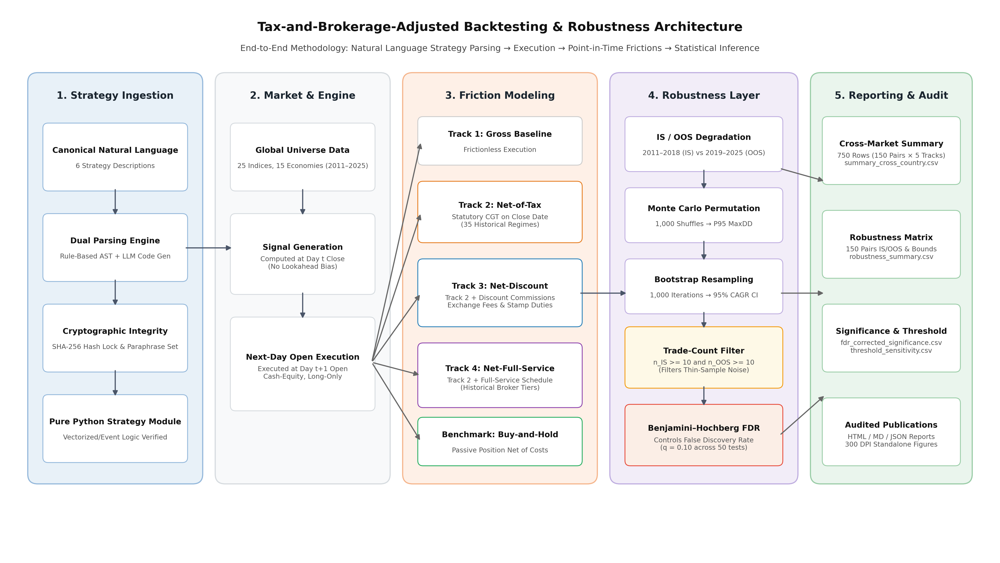
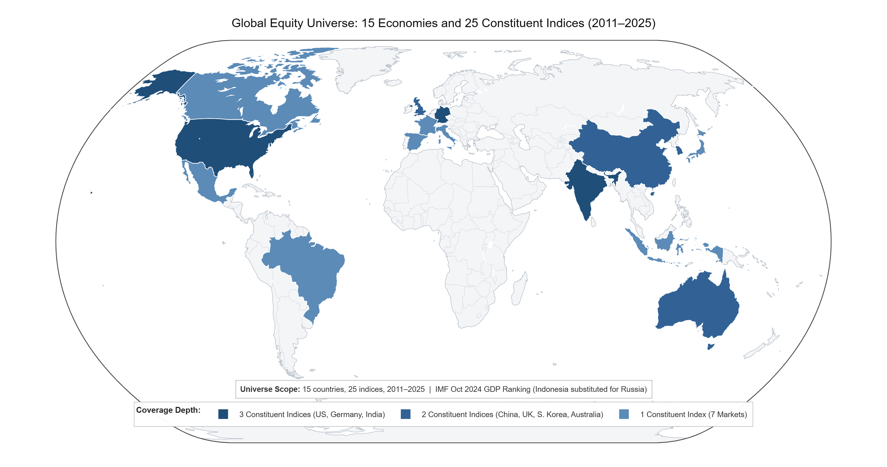
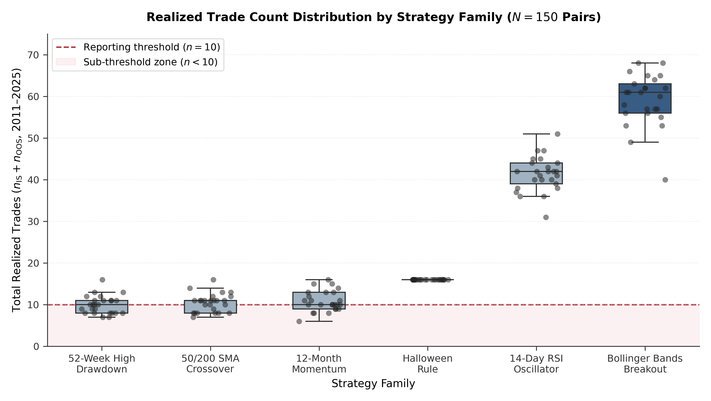
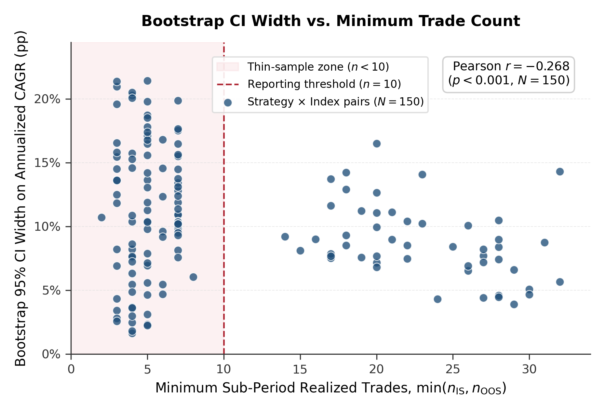
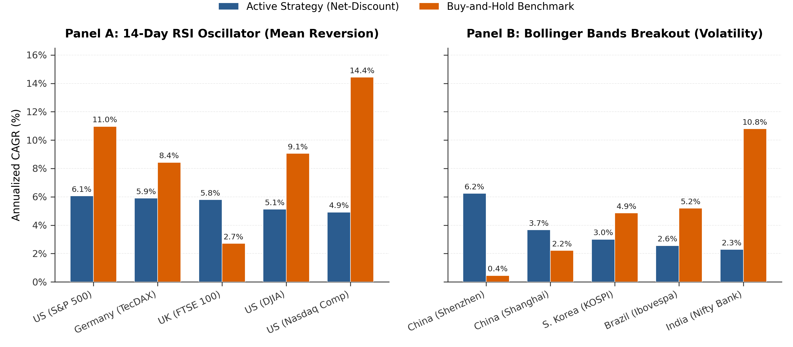

# Walkthrough: Reviewer Figure Integration & Manuscript PDF Compilation

This document summarizes the integration of the five reviewer figures into `docs/paper_draft.tex` and `docs/paper_draft.md`, the compilation of the LaTeX manuscript to PDF (`docs/paper_draft.pdf`), visual validation of rendered PDF figure pages, and verification of the test suite.

---

## 1. Figure Reading Order & Label Concordance

Both `docs/paper_draft.tex` and `docs/paper_draft.md` agree strictly on the 1–5 sequence, file references, in-text citations, and placements:

| Order | Target File | Label / Number | Placement | In-Text Citation |
| :--- | :--- | :--- | :--- | :--- |
| **Figure 1** | `figures/fig4_pipeline_architecture.png` | `\label{fig:pipeline}` | Start of Methods, before `\subsection{Universe}` | `Figure~\ref{fig:pipeline}` / `**Figure 1**` |
| **Figure 2** | `figures/fig3_universe_map.png` | `\label{fig:universe-map}` | End of `\subsection{Universe}`, after country/index scope | `Figure~\ref{fig:universe-map}` / `**Figure 2**` |
| **Figure 3** | `figures/fig5_trade_count_distribution.png` | `\label{fig:trade-dist}` | Results Section 4.1, immediately before CI-width figure | `Figure~\ref{fig:trade-dist}` / `**Figure 3**` |
| **Figure 4** | `figures/fig1_ci_width_vs_trades.png` | `\label{fig:ci-width}` | Results Section 4.1 (existing CI-width figure) | `Figure~\ref{fig:ci-width}` / `**Figure 4**` |
| **Figure 5** | `figures/fig2_n10_leaderboard.png` | `\label{fig:leaderboard}` | Results Section 4.2 (existing leaderboard figure) | `Figure~\ref{fig:leaderboard}` / `**Figure 5**` |

- **No Hardcoded Numbering**: All LaTeX in-text citations use `\ref{fig:...}` exclusively (no hardcoded "Figure 1", "Figure 2", etc.).
- **No Orphaned Floats**: Every figure is cited in the prose immediately preceding or succeeding its float environment.
- **Graphicspath Configured**: `\graphicspath{{figures/}{docs/figures/}{./}}` ensures robust path resolution across build contexts.

---

## 2. Integrated Figures

### Figure 1: Pipeline Architecture

*End-to-end methodology pipeline of the Cross-Market Strategy Battery across five sequential stages: strategy ingestion, market and execution engine, five-track statutory friction modeling, statistical robustness layer, and reporting and audit.*

### Figure 2: Global Universe Map

*Global equity universe spanning 15 economies and 25 constituent indices (2011–2025). Shading indicates index coverage depth per market: three constituent indices (United States, Germany, India), two constituent indices (China, United Kingdom, South Korea, Australia), or one constituent index (seven remaining markets).*

### Figure 3: Realized Trade Count Distribution

*Realized trade count distribution by strategy family across all 150 strategy-index pairs ($N=150$). Box plots and jittered observations depict total realized trades ($n_{\mathrm{IS}} + n_{\mathrm{OOS}}$) over the 2011–2025 window. The dashed line marks the $n=10$ reporting threshold, with the shaded region highlighting the sub-threshold thin-sample zone ($n<10$).*

### Figure 4: Bootstrap CI Width vs. Trade Count

*Bootstrap 95% confidence interval width (percentage points) versus minimum in-sample/out-of-sample trade count, Net-Discount track, all 150 strategy-index pairs. The shaded region marks the thin-sample zone ($n<10$); the vertical line marks the $n=10$ reporting threshold adopted in this study.*

### Figure 5: Net-Discount Leaderboard

*Net-Discount CAGR versus Buy-and-Hold CAGR for the top five indices (by Net-Discount CAGR) within each $n \geq 10$-qualifying strategy. Panel A: 14-Day RSI Oscillator. Panel B: Bollinger Bands Breakout.*

---

## 3. Compilation & Diagnostics

- **Engine**: `tectonic` 0.17.0 (XeTeX-based multi-pass compiler).
- **Exit Code**: `0` (Success).
- **Output File**: `docs/paper_draft.pdf` (1.93 MB, 16 pages).
- **Undefined References**: `0` (all figure, section, and table cross-references resolved).
- **Undefined Citations**: `0` (all 8 bibliography citations resolved).

---

## 4. Test Suite Verification

- Ran `pytest tests/ -v`: `30 passed` (100% passing).
